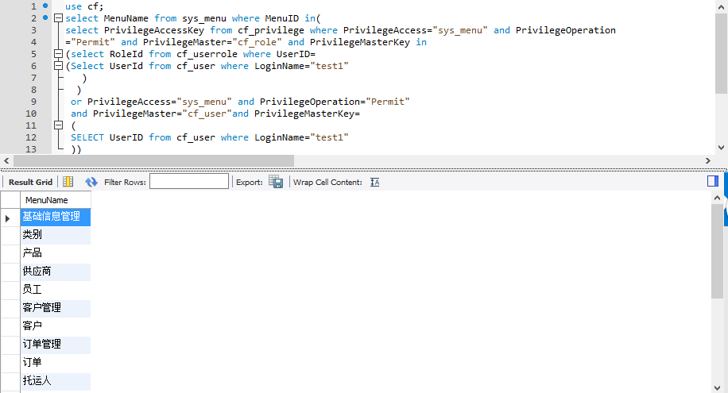
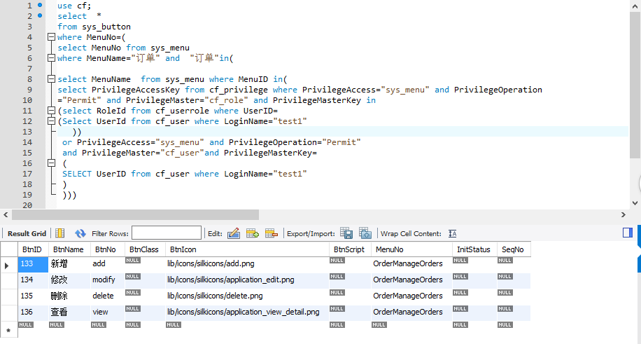

# quanxian123
##伪代码
 伪代码过程：
   1.
   a.对于一个登录用户的 LoginName
   b.根据 cf_user表的 LoginName查询UserID
   c.再根据UserID查询其cf_userrole表的  RoleID
   2.对于查到的UserID和RoleID，在cf_privilege表中查询对应页面的PrivilegeID，
   3.合并相同权限得到权限集合
   4.判断权限集合中是否有Permit权限
   5.IF 权限存在,则输出结果， ELSE则不输出。
###截图
（根据test1查询到的订单）

